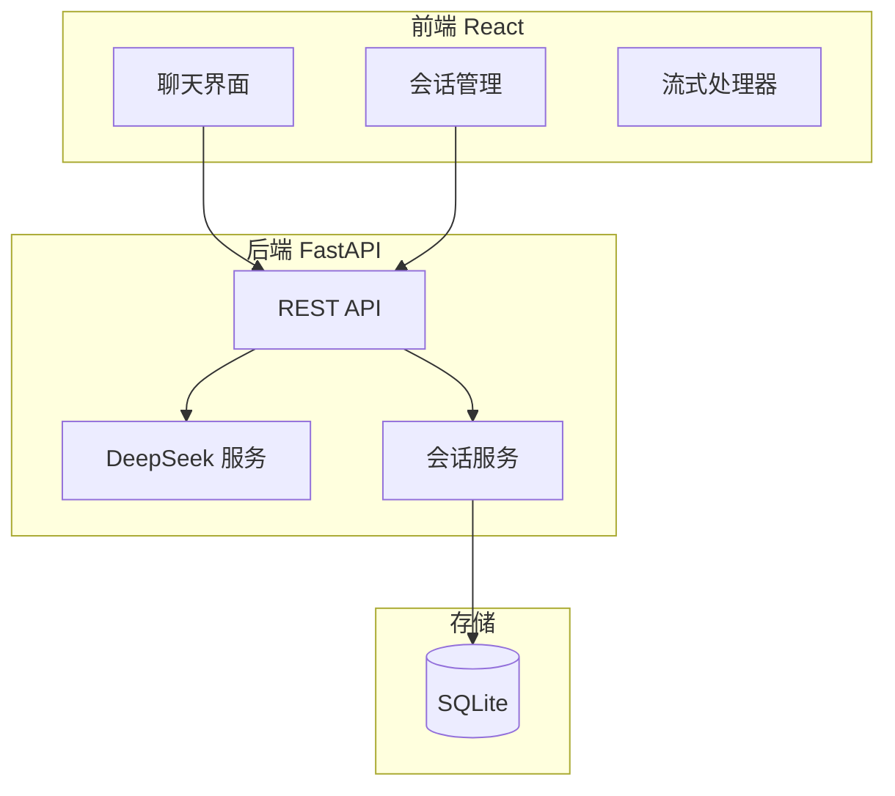

# MiniChatGPT 开发计划

## 一、项目架构概览




## 二、目录结构设计

```
MiniChatGPT/
├── backend/
│   ├── app/
│   │   ├── main.py              # FastAPI 入口
│   │   ├── config.py            # 配置（API Key 等）
│   │   ├── models/              # SQLAlchemy 数据模型
│   │   ├── schemas/             # Pydantic 请求/响应模型
│   │   ├── services/            # 业务逻辑
│   │   │   ├── llm_service.py   # DeepSeek 调用
│   │   │   └── session_service.py
│   │   └── routers/             # API 路由
│   ├── requirements.txt
│   └── alembic/                 # 数据库迁移（可选）
├── frontend/
│   ├── src/
│   │   ├── components/          # 可复用组件
│   │   ├── pages/               # 页面
│   │   ├── hooks/               # 自定义 Hooks（如 useStreamChat）
│   │   ├── services/            # API 调用
│   │   └── stores/              # 状态管理（Context/Zustand）
│   ├── package.json
│   └── vite.config.js
└── README.md
```

## 三、数据库设计（SQLite）


| 表名         | 用途  | 核心字段                                                         |
| ---------- | --- | ------------------------------------------------------------ |
| `sessions` | 会话表 | id, title, created_at, updated_at                            |
| `messages` | 消息表 | id, session_id, role, content, reasoning_content, created_at |


- `role`: user / assistant / system
- `reasoning_content`: 仅思考模式下 assistant 消息有此字段，用于**本 turn 内**的工具调用/续传；**跨 turn 不拼接**
- 多轮对话：从 `messages` 按 session_id 查询，构建 messages 数组（仅 content，不含 reasoning_content）

## 四、后端 API 设计


| 方法     | 路径                            | 说明                                                   |
| ------ | ----------------------------- | ---------------------------------------------------- |
| POST   | `/api/chat`                   | 流式对话，Body: `{ session_id?, message, thinking_mode }` |
| GET    | `/api/sessions`               | 获取会话列表                                               |
| POST   | `/api/sessions`               | 创建新会话                                                |
| GET    | `/api/sessions/{id}/messages` | 获取某会话的消息历史                                           |
| DELETE | `/api/sessions/{id}`          | 删除会话                                                 |
| PATCH  | `/api/sessions/{id}`          | 更新会话标题                                               |


### 流式响应说明

- 使用 **Server-Sent Events (SSE)** 或 **stream=True** 的 JSON 流
- 流式 chunk 格式建议：`{ "type": "reasoning"|"content"|"done", "data": "..." }`
- 思考模式：先流式输出 `reasoning_content`，再流式输出 `content`

## 五、DeepSeek 集成要点

- **非思考模式**：`model="deepseek-chat"`，无 extra_body
- **思考模式**：`model="deepseek-chat"` + `extra_body={"thinking":{"type":"enabled"}}`，或 `model="deepseek-reasoner"`
- **流式**：`stream=True`，解析 `chunk.choices[0].delta.reasoning_content` 与 `chunk.choices[0].delta.content`
- **多轮拼接**：构建 messages 时只包含 `role` + `content`，不包含 `reasoning_content`（按官方文档要求）
- API Key 通过环境变量 `DEEPSEEK_API_KEY` 配置

## 六、前端核心功能

- **流式展示**：通过 `fetch` + `ReadableStream` 或 `EventSource` 逐字/逐块渲染
- **会话侧边栏**：展示会话列表，支持新建、切换、删除
- **思考模式切换**：顶部或输入框旁 Toggle，请求时传 `thinking_mode: true/false`
- **Markdown 渲染**：使用 `react-markdown` 渲染 assistant 回复

## 七、开发阶段与任务拆分

**执行顺序**：阶段一 → 阶段四（前端）→ 阶段二 → 阶段三（后端）→ 阶段五

### 阶段一：基础框架搭建

1. **后端**：初始化 FastAPI 项目、配置 CORS、环境变量
2. **前端**：初始化 React 项目（Vite + TypeScript 推荐）
3. **数据库**：设计并创建 sessions / messages 表，使用 SQLAlchemy ORM

### 阶段四：前端 UI 与交互（在阶段二、三之前完成）

在前端完成阶段一时，后端 API 尚未实现，需使用 **Mock 数据 / Mock API** 进行联调：

1. **Mock 层**：封装 API 调用，在无真实后端时返回 mock 会话列表、mock 流式回复
2. **聊天界面**：消息列表、输入框、发送按钮
3. **流式渲染**：对接 Mock 流式数据或后续真实 SSE，实时更新 assistant 消息内容
4. **会话侧边栏**：会话列表、新建、切换、删除
5. **思考模式 Toggle**：切换 thinking_mode，并在 UI 上区分显示 reasoning 块（可折叠）

> 待阶段二、三完成后，将 Mock 替换为真实 API 调用即可。

### 阶段二：核心对话能力（后端）

1. **LLM 服务**：实现 `llm_service.py`，封装 DeepSeek API 调用（非流式先打通）
2. **流式接口**：将 chat 接口改为 SSE 流式，解析 reasoning_content 与 content
3. **Chat API 路由**：`POST /api/chat`，支持 `session_id`、`message`、`thinking_mode`

### 阶段三：会话与多轮（后端）

1. **会话 CRUD**：实现 sessions 的增删改查 API
2. **消息持久化**：chat 时写入 messages，多轮时按 session 加载历史并构建 context
3. **上下文拼接**：仅拼接 `content`，不拼接 `reasoning_content`（遵循 DeepSeek 规范）

### 阶段五：完善与优化

1. **错误处理**：API 错误、网络异常、Token 超限提示
2. **加载状态**：发送中、流式输出中的 loading 指示
3. **基础样式**：简洁的 ChatGPT 风格布局（可后续迭代）

## 八、关键实现细节

- **流式解析**：Python 端使用 `yield` 生成器 + FastAPI `StreamingResponse`，前端用 `fetch` + `reader.getReader()` 或 `EventSource` 消费
- **思考模式 UI**：可展示为可折叠的「思考过程」区域，默认折叠
- **会话标题**：首次用户消息可截取前 N 字符作为标题，或调用模型生成简短标题（可选）

## 九、依赖建议

**后端 (requirements.txt)**  
`fastapi`, `uvicorn`, `openai`（兼容 DeepSeek）, `sqlalchemy`, `pydantic`, `python-dotenv`

**前端**  
`react`, `react-dom`, `react-markdown`, `react-router-dom`（如需多页）, 状态管理按需选择（Context / Zustand）